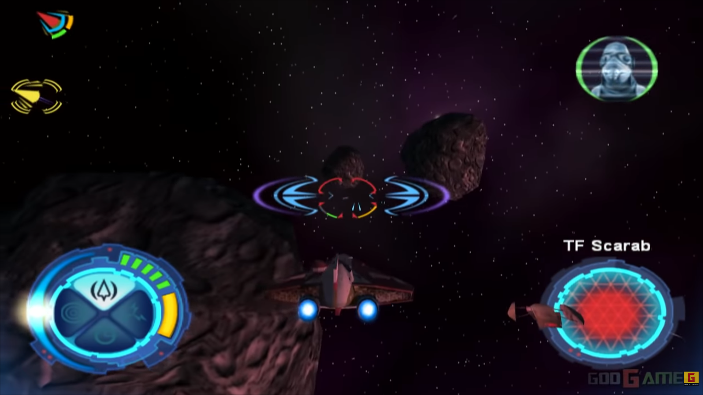
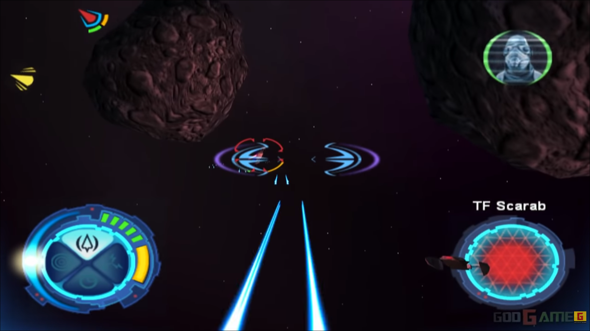
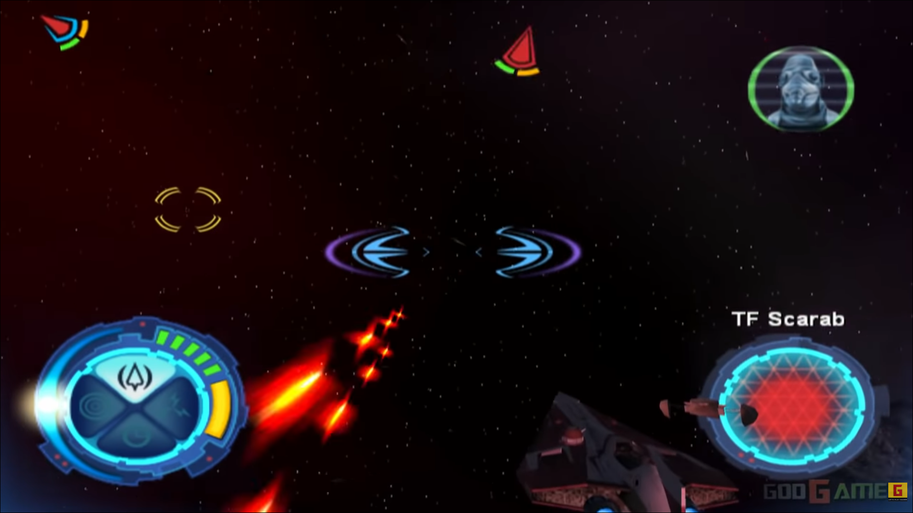

# Especificação da Implementação

> [!CAUTION]
> - Você <ins>**não pode utilizar ferramentas de IA para escrever esta
>   especificação**</ins>

## Integrantes da dupla

- **Aluno 1 - Nome**: <mark>`Caetano Szablewski Sabadini`</mark>
- **Aluno 1 - Cartão UFRGS**: <mark>`00580199`</mark>

- **Aluno 2 - Nome**: <mark>`Luiz Augusto Ponzoni Schmidt`</mark>
- **Aluno 2 - Cartão UFRGS**: <mark>`00580108`</mark>

## Detalhes do que será implementado

- **Título do trabalho**: <mark>`Caça nas Estrelas`</mark>
- **Parágrafo curto descrevendo o que será implementado**: 

A tarefa a ser implementada é um jogo de _aerial dogfight_ inspirado em __Star Wars: Starfighters (2001)__, no qual os 
jogadores controlam, com mouse e teclado, um caça estelar que deve destruir outros caças e certos alvos para vencer.

Ambas as partes podem controlar o movimento dos caças, atirar e disparar mísseis contra adversários ou alvos planejados.
O jogo será jogado em 3a pessoa, com a opção de entrar em "modo de mira" em 1a pessoa.

Em nossa implementação, os caças inimigos serão controlados por curvas de Bézier, enquanto o jogador controlará o próprio caça. 
O objetivo do jogador será destruir todos os caças inimigos e um alvo extra, que estará posicionado em uma posição guarnecida
do mapa

## Especificação visual

### Vídeo - Link

> [!IMPORTANT]
> - Coloque aqui um link para um vídeo que mostre a aplicação gráfica
>   de referência que você vai implementar. **Sua implementação deverá
>   ser o mais parecido possível com o que é mostrado no vídeo (mais
>   detalhes abaixo).**
> - **Você não pode escolher como referência: (1) algum trabalho realizado
>   por outros alunos desta disciplina, em semestres anteriores. (2) Minecraft.**
> - Por exemplo, você pode colocar um vídeo de um jogo que você gosta,
>   e seu trabalho final será uma re-implementação do jogo.
> - O vídeo pode ser um link para YouTube, Google Drive, ou arquivo mp4 dentro
>   do próprio repositório. Mas, garanta que qualquer um tenha
>   permissão de acesso ao vídeo através deste link.

<mark>`https://youtu.be/l2TadylomBY?si=1S9SdurT9xtaeDZD&t=293`</mark>

### Vídeo - Timestamp

> [!IMPORTANT]
> - Coloque aqui um **intervalo de ~30 segundos** do vídeo acima, que
>   será a base de comparação para avaliar se o seu trabalho final
>   conseguiu ou não reproduzir a referência.

- **Timestamp inicial**: <mark>`5:10`</mark>
- **Timestamp final**: <mark>`5:45`</mark>

### Imagens

> [!IMPORTANT]
> - Coloque aqui **três imagens** capturadas do vídeo acima, que você
>   irá usar como ilustração para as explicações que vêm abaixo.

## Especificação textual

Para cada um dos requisitos abaixo (detalhados no [Enunciado do Trabalho final - Moodle](https://moodle.ufrgs.br/mod/assign/view.php?id=6018620)), escreva um parágrafo **curto** explicando como este requisito será atendido, apontando itens específicos do vídeo/imagens que você incluiu acima que atendem estes requisitos.

### Malhas poligonais complexas
<mark`As malhas poligonais complexas serão implementadas no cenário, para compor tanto obstáculos espaciais (asteróides; naves-mãe) quanto objetos em movimento (caças; torretas; etc.)`</mark>

### Transformações geométricas controladas pelo usuário
<mark>`O jogador poderá entrar em modo de mira, que permitirá a ele fazer o escalamento aumentativo (zoom in) de uma região do seu campo de visão`</mark>

### Diferentes tipos de câmeras
<mark>`<preencher>`</mark>

### Instâncias de objetos
<mark>`<preencher>`</mark>

### Testes de intersecção
<mark>`<preencher>`</mark>

### Modelos de Iluminação em todos os objetos
<mark>`<preencher>`</mark>

### Mapeamento de texturas em todos os objetos
<mark>`<preencher>`</mark>

### Movimentação com curva Bézier cúbica
<mark>`<preencher>`</mark>

### Animações baseadas no tempo ($\Delta t$)
<mark>`<preencher>`</mark>

## Limitações esperadas

> [!IMPORTANT]
> - Coloque aqui uma lista de detalhes visuais ou de interação que
>   aparecem no vídeo e/ou imagens acima, mas que você **não pretende
>   implementar** ou que você **irá implementar parcialmente**.
> - Para cada item, **explique por que** não será implementado ou por
>   que será implementado parcialmente.

<mark>`<preencher>`</mark>
